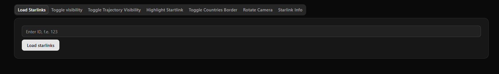

# Starlink-tracker

## BUILD

For now, the program should be run in `Release` configuration on `x64` platform

### Requirements

* Visual Studio 2022 with C++ packages
* OpenSSL
* Account on [N2YO](https://www.n2yo.com/), to generate API key

### Libcurl build

In case of libcurl errors, download it and build it yourself.

Download it from here [curl github](https://github.com/curl/curl) and then unzip/untar it. Then use this command (make sure you have OpenSSL!) and change the paths to match the location of the files on your computer.

``` cmake
cmake -B build -G "Visual Studio 17 2022" -A x64 -DCMAKE_BUILD_TYPE=Release -DBUILD_SHARED_LIBS=OFF -DCURL_STATICLIB=ON -DCURL_USE_LIBPSL=OFF -DCURL_USE_OPENSSL=ON -DOPENSSL_ROOT_DIR="C:\Program Files\OpenSSL-Win64" -DOPENSSL_INCLUDE_DIR="PATH_TO_OPENSSL_INCLUDE_DIR" -DOPENSSL_CRYPTO_LIBRARY="PATH_TO_OPENSSL_LIBCRYPTO_LIB" -DOPENSSL_SSL_LIBRARY="PATH_TO_OPENSSL_LIBSSL_LIB"
```

For example:

``` cmake
cmake -B build -G "Visual Studio 17 2022" -A x64 -DCMAKE_BUILD_TYPE=Release -DBUILD_SHARED_LIBS=OFF -DCURL_STATICLIB=ON -DCURL_USE_LIBPSL=OFF -DCURL_USE_OPENSSL=ON -DOPENSSL_ROOT_DIR="C:\Program Files\OpenSSL-Win64" -DOPENSSL_INCLUDE_DIR="C:\Program Files\OpenSSL-Win64\include" -DOPENSSL_CRYPTO_LIBRARY="C:\Program Files\OpenSSL-Win64\lib\VC\x64\MD\libcrypto.lib" -DOPENSSL_SSL_LIBRARY="C:\Program Files\OpenSSL-Win64\lib\VC\x64\MD\libssl.lib"
```

Then go to `build` dir and execute `cmake --build . --config Release`.

Finally, copy `build/lib/Release/libcurl.lib` to `StarlinkTracker/StarlinkTracker/external/curl/lib/x64/`.

## RUN

### Main App (OPENGL)

In order to run the application, go to `StarlinkTracker`, and run `StarlinkTracker.sln` solution. Everything in Visual Studio should be all set up (We used macros for including libraries and include folders) for building and executing the app. In case of any problems, right-click the `StarlinkTracker` project in Visual Studio and go to `Properties`:


Then go to `VC++ Directories` and make sure you have all the files (include and library) that are in the given paths inside `Include Directories` and `Library Directories`. Here's an example of how it should look:


> [!CAUTION]
> Path to OpenSSL was hardcoded, make sure you have the following folder in the same location:\
> `C:\Program Files\OpenSSL-Win64\lib\VC\x64\MD`\
> Or change it to a path that points to that folder on your computer

> [!IMPORTANT]
> You must generate your API key on [N2YO](https://www.n2yo.com/), and store it in `apiKey.txt` file in the same directory where `main.cpp` is stored. A program without an API KEY will not work.

If you check everything, and your IDE is not complaining about anything, you can simply click `f5` and it should build and run the application.

### Web App (NEXT.JS)

TODO

## Application

The application, after execution, shows the rotating Earth with country borders. To add starlinks or satellites, you must run the Web App.


The Web app looks like this:



To add a Starlink/satellite, find its ID on [N2YO](https://www.n2yo.com/) and paste it to the `Load Starlinks` tab, and click the `Load starlinks` button:


You can even enable the satellite trajectory line!


The camera can be rotated, and the user can point the camera at a particular satellite!


The web app also allows you to toggle the country's border line and get satellite info:


**Go ahead and try it by yourself!**

## Technologies used

### OpenGL APP

* C++ 17
* [OpenGL 3.3](https://www.opengl.org/) - Graphics API
* [LibCurl](https://curl.se/libcurl/c/) - for fetching API data
* [nlohmannJson](https://github.com/nlohmann/json) - JSON parser
* [N2YO](https://www.n2yo.com/) - as API for sattelites info
* [GeoJSON](https://geojson.org/) - as a JSON type for parsing countries border data
* [Natural Earth](https://www.naturalearthdata.com/) - for getting GeoJSON data about countries borders
* [libsgp4](https://github.com/dnwrnr/sgp4) - For handling the TLE2 data
* [stb_image](https://github.com/nothings/stb) - For Image processing
* [assimp](https://github.com/assimp/assimp) - Loading `.obj` model into OpenGL
* [httplib](https://github.com/yhirose/cpp-httplib) - HTTP server

### Web APP

ToDo
